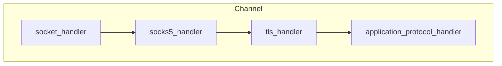

# SOCKS5 Proxy Support in AWS CRT

This document describes how SOCKS5 proxy support is built into the AWS Common Runtime (CRT), how it integrates with the existing channel handler architecture, and how to configure and consume SOCKS5 features from both the C and C++ APIs.

Note: This document is intended to guide you through the changes introduced in this pull request. You may remove this document after the PR has been reviewed and merged.

## Implementation Overview

SOCKS5 support is implemented as a channel handler (`aws_socks5_channel_handler`) that sits between the transport socket and higher-level protocol handlers. The handler drives the SOCKS5 handshake, authenticates with the proxy if required, and then becomes a transparent pass-through once the connection to the ultimate destination is established.

- `aws_client_bootstrap_new_socket_channel_with_socks5()` wraps the standard bootstrap flow to insert the SOCKS5 handler and, if needed, defer TLS until the proxy negotiation completes (see `crt/aws-c-io/source/socks5_channel_handler.c`).
- The handler uses `aws_socks5_context` utilities from `crt/aws-c-io/include/aws/io/socks5.h` to format and parse the protocol messages (greeting, optional auth, connect, reply).
- After a successful handshake the handler signals completion via the original bootstrap callbacks. If TLS is requested, the handler chains into `aws_tls_channel_handler` so that the TLS handshake runs over the proxy tunnel before handing control back to the caller.

## Channel Handler Lifecycle

The SOCKS5 channel handler maintains its own state machine (`AWS_SOCKS5_CHANNEL_STATE_*`) that maps onto the protocol’s phases:

1. **INIT** – handler created; waits for socket slot assignment.
2. **GREETING** – sends the client greeting listing supported auth methods and waits for the proxy’s selection.
3. **AUTH** – if username/password is required, sends credentials and validates the response.
4. **CONNECT** – sends the CONNECT request for the original destination, waits for the proxy’s reply.
5. **ESTABLISHED** – handshake succeeds; handler switches to transparent forwarding.
6. **ERROR** – any failure surfaces through the original setup callback with the captured error code.

Timeouts during the handshake are enforced via `connect_timeout_ms` from the proxy options (converted to nanoseconds and scheduled as a channel task). When the timeout fires the handler tears down the channel and reports `AWS_IO_SOCKET_TIMEOUT`.

## Bootstrap Integration

`aws_client_bootstrap_new_socket_channel_with_socks5()` reuses the caller’s channel options but rewrites the socket target to hit the proxy instead of the end host. Internally it:

1. Deep-copies the caller’s `aws_socks5_proxy_options`.
2. Sets the proxy target (`host`, `port`) as the TCP destination for the socket.
3. Captures the original destination endpoint (host and port) before rewiring the socket to the proxy so the handler can issue the CONNECT request on the caller’s behalf.
4. Captures TLS configuration so the TLS handler can be inserted after the SOCKS5 handshake, preserving the user’s negotiation callback and user data.
5. Installs the SOCKS5 handler as an intermediate channel slot before optionally chaining in TLS and higher-level protocol handlers.

During shutdown the adapter restores the original callbacks and cleans up the copied proxy/TLS options to avoid leaking allocations.

## Configuration Options

`struct aws_socks5_proxy_options` (declared in `crt/aws-c-io/include/aws/io/socks5.h`) contains all configuration needed by the proxy handler:

| Field | Description |
| ----- | ----------- |
| `host`, `port` | SOCKS5 proxy endpoint (owned strings copied by init helpers). |
| `username`, `password` | Optional credentials. If both are set, username/password auth is negotiated. |
| `connection_timeout_ms` | Milliseconds to wait for the full SOCKS5 negotiation before timing out. |
| `host_resolution_mode` | Controls whether the destination hostname is resolved by the proxy (`PROXY`) or by the local client (`CLIENT`). Defaults to the proxy behaviour for backwards compatibility. |

The destination endpoint (host, port, and inferred address type) is captured when the SOCKS5 context is initialized or when the channel handler is constructed; applications no longer set it directly on the proxy options.

Helper functions:

- `aws_socks5_proxy_options_init()` / `_init_default()` allocate and populate proxy host/port.
- `aws_socks5_proxy_options_set_auth()` copies username/password credentials (RFC 1929 limits apply).
- `aws_socks5_proxy_options_set_host_resolution_mode()` switches between proxy-resolved (`AWS_SOCKS5_HOST_RESOLUTION_PROXY`) and client-resolved (`AWS_SOCKS5_HOST_RESOLUTION_CLIENT`) destinations. Use client resolution when the proxy cannot resolve the target hostname or when your application needs to pin specific IPs.
- Destination host/port are supplied when initializing the SOCKS5 context; no extra helper is required on the proxy options.
- `aws_socks5_proxy_options_copy()` and `_clean_up()` provide deep-copy semantics used by the bootstrap layer and language bindings.

### C++ Wrapper (`Aws::Crt::Io::Socks5ProxyOptions`)

The C++ wrapper in `include/aws/crt/io/Socks5ProxyOptions.h` owns an `aws_socks5_proxy_options` instance and exposes the same configuration through constructors and RAII semantics. It defaults to the process allocator and ensures copies are deep copies while moves transfer ownership. New helpers (`SetHostResolutionMode()` / `GetHostResolutionMode()`) surface the host-resolution toggle via the strongly typed `AwsSocks5HostResolutionMode` enum.

CLI samples accept `socks5h://` URIs to keep the legacy “proxy-resolved DNS” behaviour, and now also recognise `socks5://` URIs when DNS resolution should stay on the client. The calculated scheme is translated directly into the C struct’s `host_resolution_mode`.

## High-Level Client Integration

SOCKS5 proxy integration is available to higher-level protocols through their respective connection options:

- **HTTP** – `aws_http_client_connection_options::socks5_proxy_options` and `Aws::Crt::Http::HttpClientConnectionOptions::Socks5ProxyOptions` forward SOCKS5 configuration into the bootstrap path (`crt/aws-c-http/source/connection.c`). If both HTTP and SOCKS5 proxies are supplied, HTTP proxy options take precedence because the HTTP path must control the CONNECT tunnel yourself.
- **MQTT 3.1.1** – call `aws_mqtt_client_connection_set_socks5_proxy_options()` before `Connect()` (implemented in `crt/aws-c-mqtt/source/client.c`). The C++ `Aws::Crt::Mqtt::MqttConnection::SetSocks5ProxyOptions()` helper forwards the wrapper options.
- **MQTT5** – populate `aws_mqtt5_client_options::socks5_proxy_options` or call `Aws::Crt::Mqtt5::Mqtt5ClientOptions::WithSocks5ProxyOptions()`. During connection (`crt/aws-c-mqtt/source/v5/mqtt5_client.c`) SOCKS5 is preferred over HTTP proxies when both are set, mirroring MQTT3 behavior.

Once the SOCKS5 handshake succeeds the rest of the protocol stack operates exactly as it would over a direct TCP connection.

## Channel Handler Stack

The channel is composed of handlers layered in order, regardless of protocol. The SOCKS5 handler negotiates the proxy before handing control to TLS (if enabled) and the final application protocol handler.



Once negotiation completes the SOCKS5 handler becomes transparent, leaving the downstream handlers to operate as if the connection were direct.

## C++ MQTT5 Usage Example

```cpp
#include <aws/crt/Api.h>
#include <aws/crt/io/Socks5ProxyOptions.h>
#include <aws/crt/mqtt/Mqtt5Client.h>

using namespace Aws::Crt;

void ConnectThroughProxy() {
    ApiHandle apiHandle;

    Io::Socks5ProxyOptions proxyOptions(
        "proxy.internal.local",          /* proxy host */
        1080,                            /* proxy port */
        Io::AwsSocks5AuthMethod::UsernamePassword,
        "alice",                         /* username */
        "s3cr3t!",                       /* password */
        10000,                           /* timeout in ms */
        ApiAllocator());

    Mqtt5::Mqtt5ClientOptions mqttOptions;
    mqttOptions.WithHostName("broker.example.com")
        .WithPort(8883)
        .WithBootstrap(ApiHandle::GetOrCreateStaticDefaultClientBootstrap())
        .WithSocketOptions(Io::SocketOptions())
        .WithTlsConnectionOptions(Io::TlsConnectionOptions())
        .WithSocks5ProxyOptions(proxyOptions);

    auto client = Mqtt5::Mqtt5Client::Create(mqttOptions);
    if (!client) {
        fprintf(stderr, "Failed to create MQTT5 client: %s\n", ErrorDebugString(LastError()));
        return;
    }

    client->Start(); /* the client handles reconnects and lifecycle callbacks */
}
```

Key points:

- Configure proxy options *before* starting the client.
- Supply TLS settings as usual—the TLS handshake automatically runs after the SOCKS5 negotiation.
- `connection_timeout_ms` should cover the full round-trip to the proxy and destination handshake.
- When you already have a `socks5://` or `socks5h://` URI, call `Io::Socks5ProxyOptions::CreateFromUri()` to populate the options in one step (see the example applications for usage).

## Best Practices and Notes

- Enable TRACE logging for `AWS_LS_IO_SOCKS5` when debugging handshake issues—the handler logs state transitions and proxy replies.
- Username/password credentials are limited to 255 bytes each (RFC 1929). Longer values will fail validation in `aws_socks5_proxy_options_set_auth()`.
- When both HTTP and SOCKS5 proxies are configured for MQTT the HTTP proxy wins, since the HTTP path needs to manage CONNECT tunnels explicitly.
- `aws_socks5_infer_address_type()` (used internally during context setup) determines whether the destination is IPv4, IPv6, or a hostname. Override the value manually only if you need non-standard routing.
- Remember to clean up `aws_socks5_proxy_options` with `aws_socks5_proxy_options_clean_up()` when using the C API directly. The C++ wrapper performs this automatically.

## Comments for reviewers

- **New binaries added for testing:**
    - Binaries such as `mqtt5_socks5_app`, `http_client_app`, `mqtt5_client_app`, and `mqtt3_client_app` have been added for testing purposes. These can be removed or converted into integration tests if needed.
- **Example updates:**
    - Existing example applications have been updated to set SOCKS5 options. These examples may contain boilerplate code and can be refactored for clarity and maintainability.
- **Integration test instructions:**
    - Instructions for running integration tests have been added to the documentation. These instructions are temporary and can be removed once the PR has been reviewed and merged.
- **HTTP cleanup changes:**
    - Some changes were made to address double cleanup when both SOCKS5 and HTTP channel handlers are notified about a connection failure. This issue was triggered by the MQTT canary test. The change should be double-checked, as it might be a false positive.
- **Proxy precedence:**
    - If both HTTP proxy and SOCKS5 proxy options are set, SOCKS5 currently takes precedence. In some cases, this is detected and an error is reported. The logic for proxy precedence may need to be revisited to ensure all scenarios are handled correctly.
